# ESP32-CAM Monitoramento com Alerta Ultrassônico e Envio para API

## Objetivo

Este projeto implementa um sistema baseado na ESP32-CAM (modelo AI Thinker) para captura de fotos e envio via HTTP para uma API, quando um objeto é detectado a uma distância inferior a 5 cm usando um sensor ultrassônico. O sistema também aciona um alarme sonoro/visual por meio de um pino de saída.

## Pré-requisitos

- **Hardware**
  - ESP32-CAM (AI Thinker)
  - Sensor ultrassônico (HC-SR04 ou similar)
  - Fios jumper, resistores (se necessário)
  - Fonte de alimentação 5V para a ESP32-CAM

- **Software**
  - Biblioteca `esp_camera.h` (disponível na framework do ESP32 Arduino)
  - Biblioteca `WiFi.h`
  - Biblioteca `HTTPClient.h`
  - Biblioteca padrão `time.h`
  - Configuração NTP para sincronização de data/hora

- **Conhecimentos Necessários**
  - Noções de C++ e Arduino
  - Configuração de redes Wi-Fi
  - Conceitos básicos de HTTP e APIs REST

## Custos Estimados

- Custo do hardware (ESP32-CAM, sensor ultrassônico, componentes): aproximadamente US$ 10-20
- Custos de infraestrutura para a API na nuvem (dependendo do provedor e volume de requisições)
- Consumo de energia (baixo, típico de IoT)
- Não há licenciamento adicional obrigatório

## Instalação e Início Rápido

1. Conecte a ESP32-CAM e o sensor ultrassônico aos GPIOs especificados.
2. Instale o Arduino IDE e adicione a placa "ESP32" através do gerenciador de placas.
3. Configure as bibliotecas necessárias no Arduino IDE.
4. Atualize as variáveis `ssid`, `password` e `base_url` no código.
5. Carregue o código para a ESP32-CAM.
6. Monitore o console serial para ver a inicialização e os logs.

## Descrição Geral

- O código configura a ESP32-CAM e o sensor ultrassônico.
- Quando o sensor detecta um objeto a menos de 5 cm, a ESP32-CAM captura uma foto e a envia para a API via HTTP PUT.
- O alarme é acionado enquanto a presença for detectada.
- O sistema sincroniza o horário usando NTP.

## Detalhamento de Funções/Métodos

### blinkFlash(pin, duration_ms)
- **Propósito**: Piscar o LED do flash por um tempo determinado.
- **Parâmetros**: `pin` (número do pino), `duration_ms` (tempo em milissegundos).
- **Retorno**: Nenhum.

### connectWiFi()
- **Propósito**: Conectar ao Wi-Fi com as credenciais especificadas.
- **Parâmetros**: Nenhum.
- **Retorno**: Nenhum.

### getDateTimeString()
- **Propósito**: Obter a data/hora atual no formato "YYYYMMDD_HHMMSS".
- **Parâmetros**: Nenhum.
- **Retorno**: `String` com data/hora ou "no_time" se falhar.

### medirDistanciaCM()
- **Propósito**: Medir a distância usando o sensor ultrassônico.
- **Parâmetros**: Nenhum.
- **Retorno**: Distância em cm (float) ou -1 se não houver leitura.

### captureAndSendPhoto(datetime)
- **Propósito**: Capturar uma foto e enviar para a API.
- **Parâmetros**: `datetime` (String para nome do arquivo).
- **Retorno**: Nenhum.

## Fluxo de Execução

1. `setup()` inicializa a câmera, Wi-Fi, sensor ultrassônico e sincroniza o NTP.
2. `loop()` mede a distância a cada ciclo.
3. Se a distância for menor que o limite (5 cm), ativa o alarme e, periodicamente, captura e envia fotos.
4. Se não houver presença, desativa o alarme.

## Estruturas de Dados

- Uso de tipos primitivos (`float`, `String`, `unsigned long`).
- A escolha por `String` facilita a manipulação de data/hora e URLs.

## Interações entre Componentes

- O sensor ultrassônico envia pulsos e mede o tempo de eco para calcular a distância.
- A câmera captura imagens e interage com a rede via HTTPClient.
- O NTP fornece data/hora para nomear os arquivos de imagem.

## Exemplos de Uso

- Exemplo de nome de arquivo gerado: `foto_20250526_153045.jpg`.
- URL gerada: `https://**********.execute-api.us-east-1.amazonaws.com/v1/<bucket name>/foto_20250526_153045.jpg`.

## Notas e Possíveis Melhorias

- A leitura do sensor pode ser afetada por ruídos ou superfícies irregulares.
- Melhorar o tratamento de erros (Wi-Fi, HTTP, captura de foto).
- Implementar autenticação na API para maior segurança.
- Otimizar o consumo de energia para maior autonomia.
- Ajustar a resolução e qualidade da imagem conforme a necessidade.

``` mermaid
%%{init: {
  'theme': 'base',
  'themeVariables': {
    'background': '#121212',
    'primaryColor': '#bb86fc',
    'primaryTextColor': '#ffffff',
    'secondaryColor': '#3700b3',
    'secondaryTextColor': '#ffffff',
    'borderColor': '#ffffff',
    'nodeBorder': '#ffffff',
    'clusterBkg': '#222',
    'clusterBorder': '#444'
  }
}}%%
flowchart TD
    %% Definição de estilos
    classDef startEnd fill:#444,stroke:#fff,stroke-width:3px, fontColor:#fff
    classDef sensor fill:#555,stroke:#fff,stroke-width:2px, fontColor:#fff
    classDef processing fill:#666,stroke:#fff,stroke-width:2px, fontColor:#fff
    classDef hardware fill:#777,stroke:#fff,stroke-width:2px, fontColor:#fff
    classDef cloud fill:#555,stroke:#fff,stroke-width:2px, fontColor:#fff
    classDef notification fill:#444,stroke:#fff,stroke-width:2px, fontColor:#fff

    %% Componentes principais
    START([Inicialização do Sistema]):::startEnd
    NTP[Sincronização NTP]:::processing
    SENSOR{Sensor de Presença}:::sensor
    
    %% Processamento local
    PHOTO[Captura de Imagem]:::processing
    BUZZER[Ativar Buzzer]:::hardware
    LCD[Exibir no LCD]:::hardware
    UART[Comunicação UART]:::hardware
    
    %% Nuvem e notificações
    API[Upload via REST API]:::cloud
    S3[(Armazenamento S3)]:::cloud
    LAMBDA[Função Lambda]:::cloud
    SNS[Amazon SNS]:::notification
    EMAIL[Notificação E-mail]:::notification
    SMS[Notificação SMS]:::notification
    
    %% Estados
    DETECTED[Presença Detectada]:::sensor
    NOT_DETECTED[Presença Não Detectada]:::sensor
    WAIT[Aguardar Próxima Verificação]:::processing

    %% Fluxo principal
    START --> NTP
    NTP --> SENSOR
    
    %% Detecção de presença
    SENSOR -->|Presença detectada| DETECTED
    SENSOR -->|Presença não detectada| NOT_DETECTED
    
    %% Ações quando presença é detectada
    DETECTED --> PHOTO
    DETECTED --> BUZZER
    DETECTED --> UART
    
    %% Processamento paralelo de hardware
    UART --> LCD
    BUZZER --> WAIT
    LCD --> WAIT
    
    %% Upload e notificações
    PHOTO -->|HTTP Upload| API
    API -->|Trigger Event| S3
    S3 -->|S3 Event| LAMBDA
    LAMBDA --> SNS
    SNS --> EMAIL
    SNS --> SMS
    
    %% Retorno ao loop
    NOT_DETECTED --> WAIT
    EMAIL --> WAIT
    SMS --> WAIT
    WAIT -->|Delay| SENSOR

    %% Agrupamento visual
    subgraph "Hardware Local"
        BUZZER
        LCD
        UART
    end
    
    subgraph "Serviços AWS"
        API
        S3
        LAMBDA
        SNS
    end
    
    subgraph "Notificações"
        EMAIL
        SMS
    end

```

# Tabela de Precificação Média do Projeto ESP32-CAM com AWS

| Serviço AWS         | Descrição do Uso                          | Nível Gratuito                                  | Uso Médio Estimado              | Custo Mensal (USD)         |
|----------------------|-------------------------------------------|------------------------------------------------|----------------------------------|----------------------------|
| **API Gateway**      | Chamadas HTTP para upload de fotos        | 1M requisições/mês (12 meses)                  | 500.000 requisições              | $0,00 (dentro do free tier) |
| **AWS Lambda**       | Processamento de imagens e triggers       | 1M requisições + 400.000 GB-s/mês              | 300.000 GB-s + 200K requisições  | $0,00 (dentro do free tier) |
| **Amazon S3**        | Armazenamento de fotos (10 GB)            | 5 GB/mês                                       | 10 GB                            | $0,12 [(10-5)*$0,023]       |
| **SNS (Email)**      | Notificações por e-mail                   | 1.000 e-mails/mês                              | 300 e-mails                      | $0,00 (dentro do free tier) |
| **SNS (SMS)**        | Notificações por SMS (Brasil)             | 100 SMS/mês (varia por país)                   | 150 SMS                         | $5,00 [50 SMS * $0,10]      |
| **Transferência de Dados** | Download de fotas via internet        | 100 GB/mês                                     | 2 GB                             | $0,00 (dentro do free tier) |
| **Total**            |                                           |                                                |                                  | **$5,12/mês**              |

### Legenda e Pressupostos:
1. **API Gateway**:  
   - Custo pós-free tier: $1,00/milhão de requisições [1][9].  
   - Exemplo: 500K requisições = 50% do free tier.

2. **AWS Lambda**:  
   - Custo pós-free tier: $0,20/milhão de requisições + $0,0000166667/GB-s [6].  
   - Função com 512 MB de RAM e 1s de execução: 0,5 GB-s por invocação.

3. **Amazon S3**:  
   - Armazena 10 GB de fotos (5 GB free). Custo adicional: $0,023/GB [8][16].  
   - Operações PUT/GET dentro do free tier (2K PUT + 20K GET).

4. **SNS (SMS)**:  
   - Preço no Brasil: ~$0,10/SMS após 100 mensagens gratuitas [7][11].  
   - SMS promocional: $0,00645/SMS (EUA) [7].

5. **Economias Potenciais**:  
   - Usar HTTP API (60% mais barato que REST API) [15][17].  
   - Ativar cache no API Gateway para reduzir chamadas ao backend.
